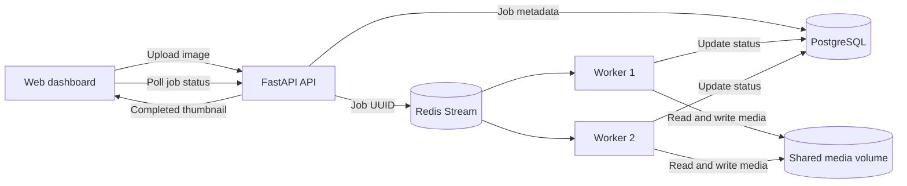

# ForgeQueue

[](https://github.com/AlexanderDeal/ForgeQueue/actions/workflows/ci.yml)
[](https://www.python.org/)
[](https://fastapi.tiangolo.com/)

ForgeQueue is a distributed image-processing service built as a backend
engineering portfolio project. Users upload a PNG or JPEG through a small web
dashboard, the API records a durable job and publishes it to Redis, and a pool
of independent workers creates thumbnails asynchronously.

The project focuses on the systems behind the interface: durable state,
concurrent workers, retry and crash recovery, database migrations, containerized
services, automated tests, and repeatable performance measurement.

## What it demonstrates

- A typed FastAPI API with file-content validation and a 5 MB upload limit
- PostgreSQL as the durable source of truth for job state
- Redis Streams consumer groups for distributing work across worker processes
- Retryable processing with bounded exponential backoff and stale-job recovery
- Idempotent job processing and explicit lifecycle transitions
- Pillow thumbnail generation with aspect-ratio preservation
- Alembic database migrations
- A multi-service Docker Compose development environment
- Pytest coverage and GitHub Actions CI
- An S3 storage adapter and documented AWS deployment path, without provisioning
  paid infrastructure
- An end-to-end concurrency benchmark

## Architecture



PostgreSQL owns job state; Redis is delivery infrastructure. Queue messages
contain only a job UUID and delivery attempt rather than a serialized job.
Workers in one consumer group divide the available work, acknowledge messages
only after handling them, and reclaim stale pending messages after crashes.

Each upload creates one independent job and one result. Multiple workers let
several uploads—from one user or many users—run concurrently.

## Job lifecycle

```text
PENDING -> QUEUED -> PROCESSING -> COMPLETED
                            |
                            +-> FAILED -> RETRYING -> QUEUED
```

Failures are retried up to a configurable limit. A permanently unsuccessful
job remains `FAILED` with an error message. A completed job is not processed
again if a duplicate queue delivery occurs.

## Quick start

### Prerequisites

- Docker Desktop with Docker Compose
- Hardware virtualization enabled if Docker Desktop uses WSL 2 on Windows

### Start the stack

```powershell
git clone https://github.com/AlexanderDeal/ForgeQueue.git
cd ForgeQueue
docker compose up --build
```

Then open:

- Dashboard: <http://127.0.0.1:8000>
- Interactive API documentation: <http://127.0.0.1:8000/docs>
- Health check: <http://127.0.0.1:8000/health>

Compose starts PostgreSQL and Redis, applies Alembic migrations, launches the
API, and starts two worker replicas. PostgreSQL, Redis, and media data use named
volumes, so they survive a normal restart.

Useful commands:

```powershell
# Follow service logs
docker compose logs -f

# Run four workers instead of two
docker compose up -d --scale worker=4

# Stop containers but retain data
docker compose down

# Delete containers and all named-volume data
docker compose down -v
```

## API

| Method | Route | Purpose |
| --- | --- | --- |
| `GET` | `/health` | Check API availability |
| `POST` | `/jobs` | Validate an image and enqueue a job |
| `GET` | `/jobs/{job_id}` | Read the current job status |
| `GET` | `/jobs/{job_id}/result` | Download a completed thumbnail |

Example upload:

```powershell
curl.exe -F "uploaded_file=@C:\path\to\photo.jpg" http://127.0.0.1:8000/jobs
```

The dashboard stores friendly filenames in browser local storage. PostgreSQL
stores UUID job identifiers and processing metadata; authentication and
per-user ownership are intentionally outside the current project scope.

## Development without Docker

Python 3.14, PostgreSQL, and Redis must already be running. Create a virtual
environment, install the project, copy the settings from `.env.example` into
your environment, and start each process separately:

```powershell
python -m venv .venv
.\.venv\Scripts\Activate.ps1
python -m pip install -e ".[dev]"
python -m alembic upgrade head
python -m uvicorn app.main:app --reload
```

In another activated terminal:

```powershell
python -m app.worker
```

## Tests

The unit and API tests use in-memory test doubles where appropriate, so they do
not require PostgreSQL or Redis:

```powershell
python -m pytest
```

GitHub Actions runs the test suite and builds the Docker image on every push and
pull request.

## Performance

The benchmark submits images concurrently and measures the entire interval from
upload through `COMPLETED` status. On the development machine, using a 2.8 MB,
2400×1600 JPEG for 30 requests at concurrency 10 produced:

| Workers | Throughput | Mean latency | p95 latency |
| ---: | ---: | ---: | ---: |
| 1 | 28.87 jobs/s | 0.310 s | 0.520 s |
| 2 | 40.30 jobs/s | 0.228 s | 0.363 s |
| 4 | 41.14 jobs/s | 0.223 s | 0.344 s |

Two workers increased throughput by approximately 40%. Four workers produced
little further improvement, showing that another local resource had become the
bottleneck. These numbers describe one machine and workload, not universal
capacity. See [the complete benchmark notes](docs/benchmark-results.md).

Run the same benchmark against a live local stack:

```powershell
python scripts/benchmark.py sample.jpg --workers 2 --requests 100 --concurrency 20
```

## Repository structure

```text
app/                    API, domain model, queue, worker, and storage code
app/static/             Browser dashboard
migrations/             Alembic database migrations
scripts/benchmark.py    Concurrent end-to-end benchmark
tests/                  Unit and API tests
docs/                   Design and benchmark documentation
compose.yaml            Local multi-service environment
Dockerfile              Shared API and worker image
```

## Design trade-offs and next steps

- PostgreSQL and Redis cannot share one atomic transaction. A transactional
  outbox would close the gap between committing a job and publishing it.
- Repeatedly failing jobs eventually remain `FAILED`; a dead-letter stream and
  operator tooling would improve production operations.
- Local Docker uses a shared media volume. Multi-host deployment should use the
  existing S3 adapter or another object store.
- The application does not yet implement accounts, authorization, rate limits,
  or per-user job history.
- A production readiness check should verify PostgreSQL and Redis, rather than
  only returning API process health.

## Cloud deployment path

The same image can be deployed with an API service and a separately scaled
worker service. One possible AWS design uses ECR, ECS, RDS PostgreSQL,
ElastiCache Redis, and S3. This repository creates no cloud resources and
requires no paid services to run locally. In AWS, use task roles instead of
long-lived credentials and configure budgets before provisioning resources.

## License

This project is available under the [MIT License](LICENSE).
